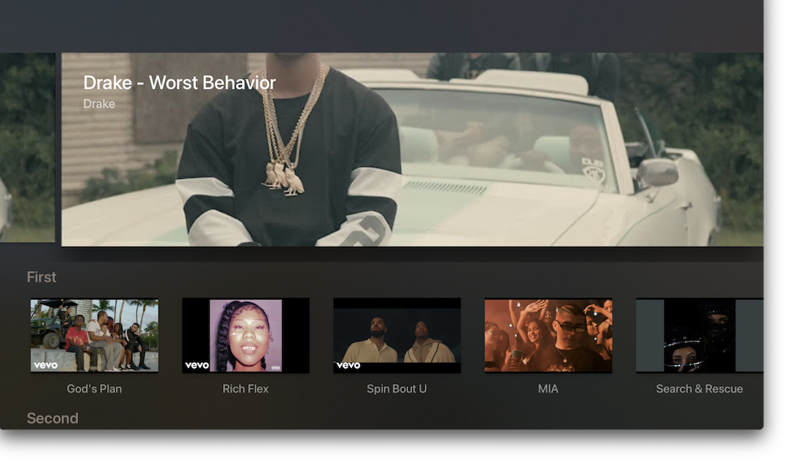

# tvOSShelfController

tvOS section shelf view made easy.

Easily set up a standard sectioned 'shelf' style view on tvOS (like in App Store, Netflix, pretty much any media app etc)

[](https://travis-ci.org/lechium/tvOSShelfController)
[](https://cocoapods.org/pods/tvOSShelfController)
[](https://cocoapods.org/pods/tvOSShelfController)
[](https://cocoapods.org/pods/tvOSShelfController)

## Example

```Objective-C
    
    #define MODEL(n,p,i) [[KBModelItem alloc] initWithTitle:n imagePath:p uniqueID:i]

    - (NSArray *)items {
    
        KBSection *section = [KBSection new];
        section.type = @"banner";
        section.size = @"1700x525";
        section.infinite = true;
        section.autoScroll = true;
        section.order = 0;
        section.className = @"KBModelItem";
    
        KBModelItem *modelItem = [KBModelItem new];
        modelItem.details = @"Drake";
        modelItem.title = @"Drake - Worst Behavior";
        modelItem.banner = @"https://i.ytimg.com/vi/CccnAvfLPvE/hq720.jpg?sqp=-oaymwEXCNAFEJQDSFryq4qpAwkIARUAAIhCGAE=&rs=AOn4CLBKduZRk6TRsKi8h4DE_cPajmtOcA";
        modelItem.uniqueID = @"CccnAvfLPvE";
        modelItem.resultType = @1;
        section.items = @[modelItem];
    
        KBSection *sectionTwo = [KBSection new];
        sectionTwo.type = @"standard";
        sectionTwo.sectionName = @"First";
        sectionTwo.size = @"320x240";
        sectionTwo.infinite = false;
        sectionTwo.autoScroll = false;
        sectionTwo.order = 1;
        sectionTwo.className = @"KBModelItem";
        sectionTwo.items = @[
        MODEL(@"God's Plan", @"https://i.ytimg.com/vi/xpVfcZ0ZcFM/hqdefault.jpg", @"xpVfcZ0ZcFM"),
        MODEL(@"Rich Flex", @"https://i.ytimg.com/vi/I4DjHHVHWAE/hqdefault.jpg", @"I4DjHHVHWAE"),
        MODEL(@"Spin Bout U", @"https://i.ytimg.com/vi/T8nbNQpRwNo/hqdefault.jpg", @"T8nbNQpRwNo"),
        MODEL(@"MIA", @"https://i.ytimg.com/vi/NveQffpaOlU/hqdefault.jpg", @"NveQffpaOlU"),
        MODEL(@"Search & Rescue", @"https://i.ytimg.com/vi/tVthyPOWc-E/hqdefault.jpg", @"tVthyPOWc-E"),
    ];
    
        KBSection *sectionThree = [KBSection new];
        sectionThree.type = @"standard";
        sectionThree.sectionName = @"Second";
        sectionThree.size = @"320x240";
        sectionThree.infinite = false;
        sectionThree.autoScroll = false;
        sectionThree.order = 1;
        sectionThree.className = @"KBModelItem";
        sectionThree.items = @[
        MODEL(@"Drake - Worst Behavior", @"https://i.ytimg.com/vi/CccnAvfLPvE/hq720.jpg?sqp=-oaymwEXCNAFEJQDSFryq4qpAwkIARUAAIhCGAE=&rs=AOn4CLBKduZRk6TRsKi8h4DE_cPajmtOcA", @"CccnAvfLPvE"),
        MODEL(@"Drake - Stars (Official Music Video) 2023", @"https://i.ytimg.com/vi/R4DZBZJsoEY/hq720.jpg?sqp=-oaymwEXCNAFEJQDSFryq4qpAwkIARUAAIhCGAE=&rs=AOn4CLAKZUsBLjiB8Ook77VQSqatPhaQ2g", @"R4DZBZJsoEY"),
        MODEL(@"DJ Khaled ft. Drake - POPSTAR (Official Music Video - Starring Justin Bieber)", @"https://i.ytimg.com/vi/3CxtK7-XtE0/hq720.jpg?sqp=-oaymwEXCNAFEJQDSFryq4qpAwkIARUAAIhCGAE=&rs=AOn4CLD9FC8VLEM86eZAY8awL1-3LgmM2g", @"3CxtK7-XtE0"),
        MODEL(@"Meek Mill - Going Bad feat. Drake (Official Video)", @"https://i.ytimg.com/vi/S1gp0m4B5p8/hqdefault.jpg?sqp=-oaymwEjCOADEI4CSFryq4qpAxUIARUAAAAAGAElAADIQj0AgKJDeAE=&rs=AOn4CLD33ZfTKyCvv6OWsoN_imf2kx3vnQ", @"S1gp0m4B5p8"),
        MODEL(@"Teenage Fever", @"https://i.ytimg.com/vi/e8HtwsnuTIw/hq720.jpg?sqp=-oaymwEXCNAFEJQDSFryq4qpAwkIARUAAIhCGAE=&rs=AOn4CLDMtNcOuNNwmb7rVQfQYpmpOeWDbA", @"e8HtwsnuTIw"),
    ];
        return @[section, sectionTwo, sectionThree];
    }

    - (KBShelfViewController *)createShelfViewController {

        KBShelfViewController *shelfViewController = [[KBShelfViewController alloc] init];
        shelfViewController.placeholderImage = [UIImage imageNamed:@"YTPlaceholder.png"];
        shelfViewController.itemSelectedBlock = ^(KBModelItem * _Nonnull item) {
            NSLog(@"item selected block: %@", item);
        };
        shelfViewController.sections = [self items];
        return shelfViewController;
    }

```

  <br/>

To run the example project, clone the repo, and run `pod install` from the Example directory first.

## Requirements

## Installation

tvOSShelfController is available through [CocoaPods](https://cocoapods.org). To install
it, simply add the following line to your Podfile:

```ruby
pod 'tvOSShelfController'
```

## Author

lechium, kevin.w.bradley@me.com

## License

tvOSShelfController is available under the MIT license. See the LICENSE file for more info.
